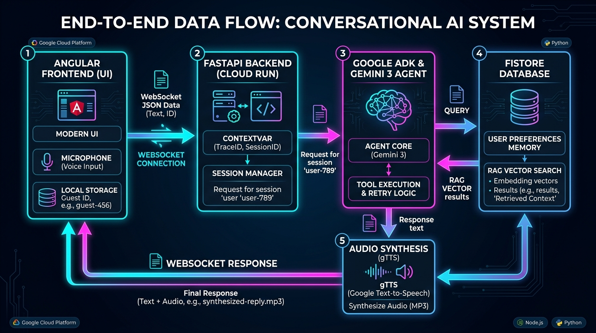
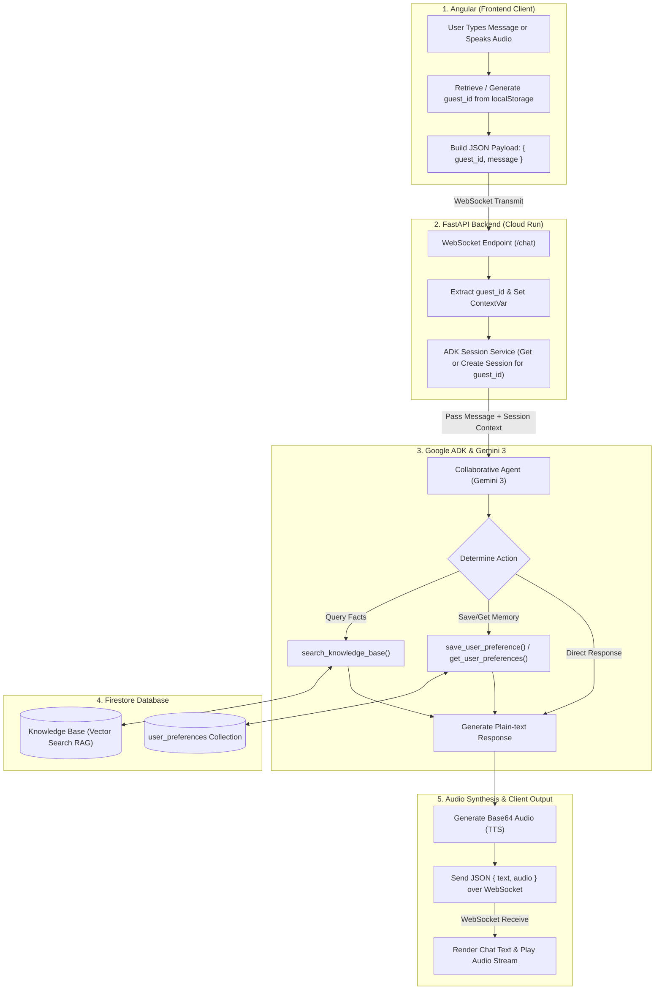

# System Data Flowchart



## ASCII Flowchart

```text
[ User Interface / Voice Input ]
               │
               ▼
   [ 1. Angular Frontend ]
   • Retrieves / Stores 'guest_id' in localStorage
   • Packages payload: { "guest_id": "...", "message": "..." }
               │
               │ (Real-time WebSocket connection: /chat)
               ▼
   [ 2. FastAPI Backend (Cloud Run) ]
   • Accepts WebSocket connection
   • Sets context variable: current_guest_id = guest_id
   • Dynamically gets or creates ADK Memory Session for guest_id
               │
               ▼
   [ 3. Google ADK & Gemini 3 Agent ]
   • Evaluates prompt & selects appropriate tool:
       ├─► Factual Q&A ──► [ Firestore: Knowledge Base (RAG Vector Search) ]
       └─► User Facts ───► [ Firestore: user_preferences Document ]
   • Generates plain conversational text response
               │
               ▼
   [ 4. Audio Synthesis & Formatting ]
   • Converts text response to Base64 audio (gTTS)
   • Packages response payload: { "text": "...", "audio": "..." }
               │
               │ (WebSocket response)
               ▼
   [ 5. Angular Client ]
   • Displays response text on screen
   • Plays base64 audio stream for user
```

---

## Mermaid Flowchart


